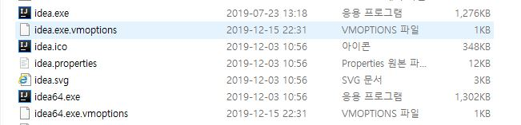
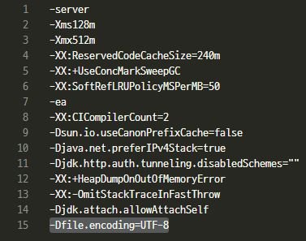
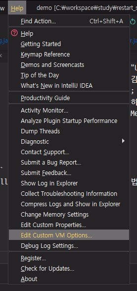
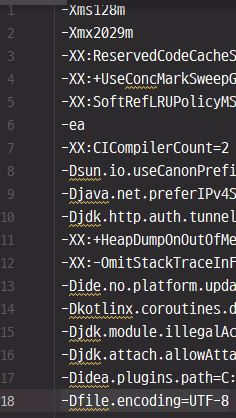
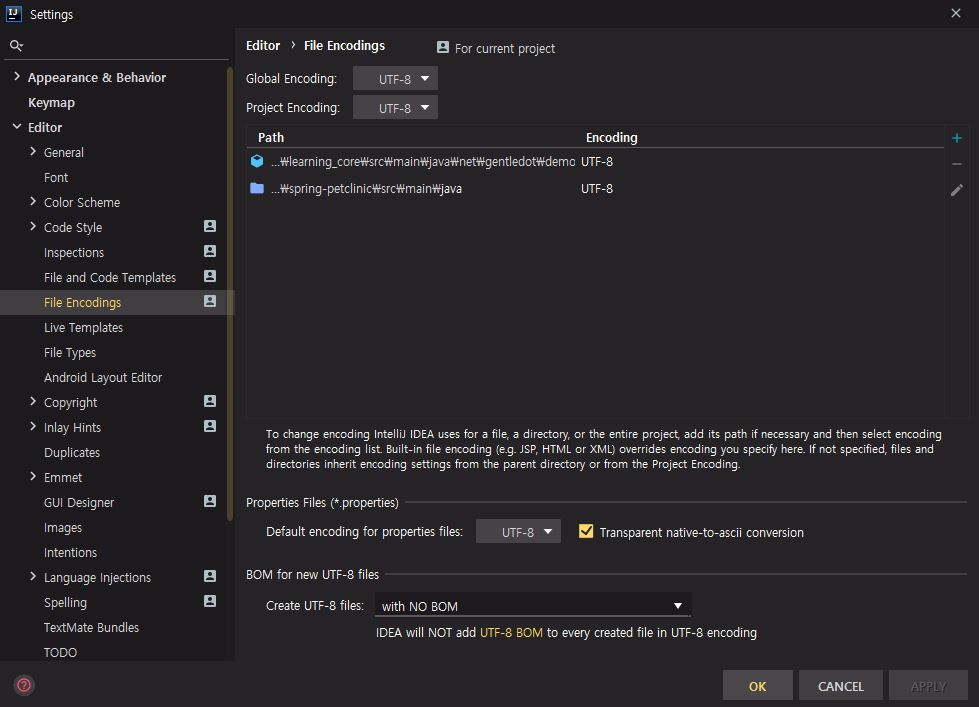
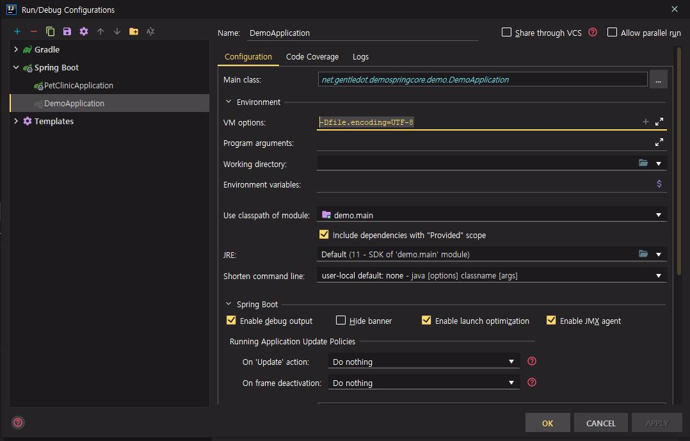

# Spring Framework Core

## 목차
- [참고 자료](#출처)
- [학습 목표](#목표)
- 학습 내용
    - [IoC Container](#IoC-Container)
        - [Bean](#Bean)
        - [ApplicationContext와 Bean 설정 방법](#ApplicationContext와-Bean-설정-방법)
        - [component-scan](#component-scan)
        - [@Autowired](#@Autowired)
        - [@Component](#@Component)
        - [Bean의 Scope](#Scope-of-Beans)
        - [Environment](#Environment)
        - [MessageSource](#MessageSource)
        - [ApplicationEventPublisher](#ApplicationEventPublisher)
        - [ResourceLoader](#ResourceLoader)
        
## 출처
- 강좌
    1. [스프링 프레임워크 핵심 기술 / 백기선](https://www.inflearn.com/course/spring-framework_core)
    
- 문서
    1. [Spring Framework Documentation - Core](https://docs.spring.io/spring/docs/current/spring-framework-reference/core.html#spring-core)
    1. [Quick Guide to Spring Bean Scopes](https://www.baeldung.com/spring-bean-scopes)
    1. [스프링 @Profile 어노테이션을 통한 환경 설정(Spring Environment Configuration, @Profile)](https://engkimbs.tistory.com/712)
    1. [Spring - IoC 컨테이너의 기능 - 4(ApplicationEventPublisher 란?)](https://galid1.tistory.com/517)
    
- 도서
    1. 스프링 4 입문 - 웹 애플리케이션의 기초부터 클라우드 네이티브 입문까지 / 하세가와 유이치, 오오노 와타루, 토키 코헤이 (옮긴이 : 권은철, 전민수, 펴낸이 : 김태현) - 한빛미디어 

## 목표
1. IoC(Inversion of Control), AOP(Aspect Oriented Programming), PSA(Portable Service Abstraction) 에 대한 이해
1. IoC Container 확인
1. Bean 과 DI(Dependency Injection) 에 대한 이해
1. Aspect 모듈화 방법
1. Spring Core 에서 제공되는 기능 확인


## 학습 내용

### IoC Container
출처 : [스프링 프레임워크 핵심 기술 / 백기선](https://www.inflearn.com/course/spring-framework_core)
> Inversion of Control: 의존 관계 주입(Dependency Injection)이라고도 하며, 어떤 객체가
  사용하는 의존 객체를 직접 만들어 사용하는게 아니라, 주입 받아 사용하는 방법을 말 함.

1. Application Component 의 중앙 저장소
1. Bean 설정 소스로부터 빈 정의를 읽어들이고 빈을 구성, 제공
1. 관련 Class
    - BeanFactory
    - ApplicationContext
        
#### Bean
- IoC Container가 관리하는 객체
- 의존성 관리
- 객체의 Scope 설정 (default : Singleton)
    - Singleton : 변하지 않는 하나, 런타임 시 성능 개선 도움 
    - Prototype : 객체 생성마다 다른 객체 (다른 메모리 주소)
    - ...
- Lifecycle interface  

    출처: [Interface BeanFactory](https://docs.spring.io/spring-framework/docs/5.0.8.RELEASE/javadoc-api/org/springframework/beans/factory/BeanFactory.html)  
   > Bean factory implementations should support the standard bean lifecycle interfaces as far as possible. The full set of initialization methods and their standard order is:
   
        1. BeanNameAware's setBeanName                                                                                                                                                                                                 
        2. BeanClassLoaderAware's setBeanClassLoader  
        3. BeanFactoryAware's setBeanFactory  
        4. EnvironmentAware's setEnvironment  
        5. EmbeddedValueResolverAware's setEmbeddedValueResolver  
        6. ResourceLoaderAware's setResourceLoader (only applicable when running in an application context)  
        7. ApplicationEventPublisherAware's setApplicationEventPublisher (only applicable when running in an application context)  
        8. MessageSourceAware's setMessageSource (only applicable when running in an application context)  
        9. ApplicationContextAware's setApplicationContext (only applicable when running in an application context)  
        10. ServletContextAware's setServletContext (only applicable when running in a web application context)  
        11. postProcessBeforeInitialization methods of BeanPostProcessors  
        12. InitializingBean's afterPropertiesSet  
        13. a custom init-method definition  
        14. postProcessAfterInitialization methods of BeanPostProcessors  
          
   > On shutdown of a bean factory, the following lifecycle methods apply:  
                                                                                                                                                                                                                                                                                                                                                                                                                                                                                                                                                                                                                                                                                                                                                                                                                                                                                                                                                                                                                                                                                                                                                                                                                                                                                                                                                                                                                                                                                                                                                                                                                              
        1. postProcessBeforeDestruction methods of DestructionAwareBeanPostProcessors  
        2. DisposableBean's destroy  
        3. a custom destroy-method definition  

- Application의 lifecycle과 Bean의 lifecycle
    
    Lifecycle of Application  
    
    | cycle | 내용 |
    |:---|---|
    | Initialization(초기화) | 이용하기 위해서 Application을 생성함.  시스템 리소스를 확보. |
    | Use(이용) | Application 에서 이용되는 과정 |
    | Destruction(종료) | 종료 처리.  시스템의 리소스를 돌려줌.  Application은 Garbage collection 의 대상이 됨. |

    - Initialization (BeanPostProcessor, InitializingBean interface)
        - Bean 정의 로드(설정)
        - Bean 생성 및 초기화
        - BeanPostProcessor.postProcessBeforeInitialization()  
        -> InitializingBean.afterPropertiesSet()   
        -> BeanPostProcessor.postProcessAfterInitialization()   
    - Use
        - ApplicationContext(BeanFactory)_getBean()
    - Destruction
        - Bean 제거 메소드
        - Bean이 사용한 리소스 반환
        - Container 종료

- lifecycle 관리  
    1. org.springframework.beans.factory.InitializingBean 인터페이스 구현
    1. annotation
        
        > 출처 : 스프링 4 입문 - 웹 애플리케이션의 기초부터 클라우드 네이티브 입문까지 / 하세가와 유이치, 오오노 와타루, 토키 코헤이 (옮긴이 : 권은철, 전민수, 펴낸이 : 김태현) - 한빛미디어 p99, 표2-6
        
        | annotation | 설명 | 
        |:---|---|
        | @PostConstruct | 초기 처리를 하는 메서드 선언. 메서드 이름은 임의로 설정 가능.  단 메서드와 인수 없이 반환형은 void 형으로 해야 함 |
        | @preDestroy | 종료 처리를 하는 메서드 선언. 메서드 이름은 임의.  단, 메서드 인수 없이 반환형은 void 형으로 해야 한다. |
        
    - @PostConstruct는 IoC container에 의해 인스턴스 변수에 무언가 injection 된 다음 호출. 즉, injection 된 값으로 초기 처리할 때 사용.  
    (다른 방법으론 생성자에서 초기 처리를 하면 된다고 함)
        ```
            @PostConstruct
            public void postConstruct(){
                System.out.println("===================");
                System.out.println("Hello SpringBoot");
                System.out.println("===================");
            }
        ```   
    - @PreDestroy는 종료 처리 시 사용. (Java에는 소멸자가 없음.)
        ```
           @PreDestroy
           public void stop(){
               System.out.println("===================");
               System.out.println("goodBye SpringBoot");
               System.out.println("===================");
           }
        ```

#### ApplicationContext와 Bean 설정 방법
- 설정 (application.xml)
```
<?xml version="1.0" encoding="UTF-8"?>
<beans xmlns="http://www.springframework.org/schema/beans"
       xmlns:xsi="http://www.w3.org/2001/XMLSchema-instance"
       xsi:schemaLocation="http://www.springframework.org/schema/beans http://www.springframework.org/schema/beans/spring-beans.xsd">

    <bean id="bookService" class="net.gentledot.demospringcore.demo.book.BookService">
        <property name="bookRepository" ref="bookRepository" />
    </bean>
    
    <bean id="bookRepository" class="net.gentledot.demospringcore.demo.book.BookRepository"></bean>
    
</beans>

```
- 설정 (@Configuration, @Bean)
```
package net.gentledot.demospringcore.demo.config;

import net.gentledot.demospringcore.demo.book.BookRepository;
import net.gentledot.demospringcore.demo.book.BookService;
import org.springframework.context.annotation.Bean;
import org.springframework.context.annotation.Configuration;

@Configuration
public class ApplicationConfig {

    @Bean
    public BookRepository bookRepository() {
        return new BookRepository();
    }
    
    @Bean
    public BookService bookService() {
        BookService bookService = new BookService();
        bookService.setBookRepository(bookRepository());
    }
}
```

- bean 꺼내기 (xml : ClassPathXmlApplicationContext)
```
public cass DemoApplication(){
    public static void main(String[] args) {
        ApplicationContext applicationContext = new ClassPathXmlApplicationContext("application.xml");
        String[] beanDefinitionNames = applicationContext.getBeanDefinitionNames();
        System.out.println(Arrays.toString(beanDefinitionNames));
        BookService bookService = (BookService) applicationContext.getBean("bookService");
        System.out.println(bookService.bookRepository != null);
    }
}
```

- bean 꺼내기 (@annotation : AnnotationConfigApplicationContext)
```
public cass DemoApplication(){
    public static void main(String[] args) {
        ApplicationContext applicationContext = new AnnotationConfigApplicationContext(ApplicationConfig.class);
    }
}
```

#### component-scan
- 설정 (application.xml)
```
<?xml version="1.0" encoding="UTF-8"?>
<beans xmlns="http://www.springframework.org/schema/beans"
       xmlns:xsi="http://www.w3.org/2001/XMLSchema-instance"
       xmlns:context="http://www.springframework.org/schema/context"
       xsi:schemaLocation="http://www.springframework.org/schema/beans http://www.springframework.org/schema/beans/spring-beans.xsd http://www.springframework.org/schema/context https://www.springframework.org/schema/context/spring-context.xsd">
    
    <context:component-scan base-package="net.gentledot.demospringcore.demo"/>

</beans>
```
- 설정 (@ComponentScan)
```
package net.gentledot.demospringcore.demo.config;

import net.gentledot.demospringcore.demo.DemoApplication;
import org.springframework.context.annotation.ComponentScan;
import org.springframework.context.annotation.Configuration;

@Configuration
@ComponentScan(basePackageClasses = DemoApplication.class)
public class ApplicationConfig {
}
```

- Bean 등록 (특정 패키지 이하의 모든 클래스 중 @Component annotation을 사용한 클래스를 Bean으로 자동 등록)
```
@Component
public class BookService {
}
```
      
#### @Autowired
- 사용할 수 있는 위치
    - Constructor (Spring 4.3 이후부터는 하나만 있는 생성자에 @Autowire 생략 가능)
        ```
        private final BookRepository bookRepository;
        
        @Autowired // Spring 4.3 이상이면 생략 가능
        public BookService(BookRepository bookRepository) {
            this.bookRepository = bookRepository;
        }
        ```
    - Field
        ```
        // @Autowired (required = false) 라면 의존성 주입이 필수가 아니어도 인스턴스 생성됨.
        @Autowired
        private BookRepository bookRepository;
        ```
    - Setter
        ```
        private BookRepository bookRepository;
            
        // @Autowired (required = false) 라면 의존성 주입이 필수가 아니어도 인스턴스 생성됨.
        @Autowired
        public void setBookRepository(BookRepository bookRepository) {
            this.bookRepository = bookRepository;
        }
        ```

- Bean 등록의 경우의 수
    1. 해당 타입의 Bean이 없는 경우
    1. 해당 타입의 Bean이 한 개인 경우
    1. 해당 타입의 Bean이 여러 개인 경우
        - 여러 Bean 중 하나만 사용해야 할 경우
            - 사용하지 않는 Bean은 제거 하거나
            - 해당하는 객체와 같은 이름의 Bean 찾으면 해당 Bean 사용
            - 못 찾으면 실패
        - 여러 Bean 중 여러 개를 사용해야 할 경우
            - 대표 객체는 @Primary로 설정
            - 이외에 사용해야할 객체는 @Qualifier 로 Bean을 찾아 사용
    
- 같은 타입의 Bean이 여러개일 때
    > Consider marking one of the beans as @Primary, updating the consumer to accept multiple beans, or using @Qualifier to identify the bean that should be consumed
    - @Primary
    - 모두 주입 받기 (일괄적인 동작을 설정해야 할 경우)
    - @Qualifier

- AutowiredAnnotationBeanPostProcessor extends BeanPostProcessor
    > 스프링이 제공하는 @Autowired와 @Value annotation 그리고 JSR-330의
      @Inject annotation 지원하는 annotation 처리기.

#### @Component
- component-scan 주요 기능
    - 스캔 위치 설정
        - classes
    - 필터 (스캔 대상 설정 / 제외 대상 설정 등)
        - excludeFilters
        - Filter
    
- component annotation class를 상속 받는 annotation
    - @Repository
    - @Service
    - @Controller
    - @Configuration

- @ComponentScan 을 통해 스캔할 패키지와 annotation 대한 정보 설정

- 실재 스캐닝은 아래 클래스에 의해 처리됨.
    ```
     public class ConfigurationClassPostProcessor implements BeanDefinitionRegistryPostProcessor,
                    PriorityOrdered, ResourceLoaderAware, BeanClassLoaderAware, EnvironmentAware
    ```

- @SpringBootApplication
    ```
    /**
     * Indicates a {@link Configuration configuration} class that declares one or more
     * {@link Bean @Bean} methods and also triggers {@link EnableAutoConfiguration
     * auto-configuration} and {@link ComponentScan component scanning}. This is a convenience
     * annotation that is equivalent to declaring {@code @Configuration},
     * {@code @EnableAutoConfiguration} and {@code @ComponentScan}.
     *
     * @author Phillip Webb
     * @author Stephane Nicoll
     * @author Andy Wilkinson
     * @since 1.2.0
     */
    @Target(ElementType.TYPE)
    @Retention(RetentionPolicy.RUNTIME)
    @Documented
    @Inherited
    @SpringBootConfiguration
    @EnableAutoConfiguration
    @ComponentScan(excludeFilters = { @Filter(type = FilterType.CUSTOM, classes = TypeExcludeFilter.class),
            @Filter(type = FilterType.CUSTOM, classes = AutoConfigurationExcludeFilter.class) })
    public @interface SpringBootApplication {}
    ```
  
- 빈 등록
    1. annotation을 통한 Bean 등록
        ```
        @Bean
        public OutsiderService outsiderService() {
            System.out.println("======");
            System.out.println("Functional Bean Definition!!");
            System.out.println("======");
            return new OutsiderService();
        }
        ```
    1. function을 사용한 Bean 등록 (순서 => Initialize 할 때 등록 후 나머지 annotation Bean 등록)
        ```
       public static void main(String[] args) {
            SpringApplication thisApp = new SpringApplication(DemoApplication.class);
       
            // ConfigurableApplicationContext -> GenericApplicationContext
            thisApp.addInitializers((ApplicationContextInitializer<GenericApplicationContext>) appCtx -> {
                // 패키지 밖 범위의 서비스를 Bean에 등록
                appCtx.registerBean(OutsiderService.class);
                appCtx.registerBean(ApplicationRunner.class, () -> args1 -> {
                    System.out.println("======");
                    System.out.println("Functional Bean Definition!!");
                    System.out.println("======");
                });
            });
            thisApp.run(args);
        }
       
       // 결과
       /* 
       2019-12-12 00:23:05.322  INFO 34468 --- [  restartedMain] n.g.demospringcore.demo.DemoApplication  : Started DemoApplication in 1.589 seconds (JVM running for 2.632)
       ======
       Functional Bean Definition!!
       ======
       org.springframework.beans.factory.annotation.AutowiredAnnotationBeanPostProcessor@23a870b6
       */
        ```

#### Scope of Beans
> 출처 : [Quick Guide to Spring Bean Scopes](https://www.baeldung.com/spring-bean-scopes) 

- Scope
    - Singleton (default)
    - Prototype
    - web-aware (HTTP Session, WebSocket session)
        - Request
        - Session
        - WebSocket
 
 - 빈을 참조 할 때...
    ```
    @Component
    public class Single {
    
        @Autowired
        Proto proto;
    
        public Proto getProto() {
            return proto;
        }
    }
    ```
    ```
    @Component @Scope("prototype")
    public class Proto {
    
        @Autowired
        Single single;
    
        public Single getSingle() {
            return single;
        }
    }
    ```
  
    ```
    @Component
    public class AppRunner implements ApplicationRunner {
    
        @Autowired
        ApplicationContext ctx;
    
        @Override
        public void run(ApplicationArguments args) throws Exception {
            System.out.println("====== single ======");
            System.out.println(ctx.getBean(Single.class));
            System.out.println(ctx.getBean(Single.class));
            System.out.println(ctx.getBean(Single.class));
            System.out.println("======");
            System.out.println("====== proto ======");
            System.out.println(ctx.getBean(Proto.class));
            System.out.println(ctx.getBean(Proto.class));
            System.out.println(ctx.getBean(Proto.class));
            System.out.println("======");
            System.out.println("====== proto by single ======");
            System.out.println(ctx.getBean(Single.class).getProto());
            System.out.println(ctx.getBean(Single.class).getProto());
            System.out.println(ctx.getBean(Single.class).getProto());
            System.out.println("======");
            System.out.println("====== single by proto ======");
            System.out.println(ctx.getBean(Proto.class).getSingle());
            System.out.println(ctx.getBean(Proto.class).getSingle());
            System.out.println(ctx.getBean(Proto.class).getSingle());
            System.out.println("======");
        }
    }
    ```
    ```
    2019-12-13 00:48:25.638  INFO 19836 --- [  restartedMain] n.g.demospringcore.demo.DemoApplication  : Started DemoApplication in 1.439 seconds (JVM running for 2.383)
    ====== single ======
    net.gentledot.demospringcore.demo.book.Single@5f9f90ee
    net.gentledot.demospringcore.demo.book.Single@5f9f90ee
    net.gentledot.demospringcore.demo.book.Single@5f9f90ee
    ======
    ====== proto ======
    net.gentledot.demospringcore.demo.book.Proto@1dcfe2cc
    net.gentledot.demospringcore.demo.book.Proto@3e74097b
    net.gentledot.demospringcore.demo.book.Proto@6c1560db
    ======
    ====== proto by single ======
    net.gentledot.demospringcore.demo.book.Proto@667c1f02
    net.gentledot.demospringcore.demo.book.Proto@667c1f02
    net.gentledot.demospringcore.demo.book.Proto@667c1f02
    ======
    ====== single by proto ======
    net.gentledot.demospringcore.demo.book.Single@5f9f90ee
    net.gentledot.demospringcore.demo.book.Single@5f9f90ee
    net.gentledot.demospringcore.demo.book.Single@5f9f90ee
    ======
    ```
    - Prototype bean이 Singleton bean을 참조하면 아무 문제 없음.
    
    - Singleton bean이 Prototype bean을 참조하면
        - Prototype bean 업데이트가 되지 않음.

- Singleton bean 사용 시 유의사항
    - ApplicationContext 초기 구동 시 instance 생성됨.
    - 긴 생명주기를 가지고 있음
    - property가 공유됨. (여러 곳에서 변경 시 같은 주소의 객체를 참조하기 때문에 의도하지 않은 값 변동이 있을 수 있음)
        
- Protype bean이 업데이트 되려면
    - scoped-proxy
        ```
        public enum ScopedProxyMode {
        	/**
        	 * Default typically equals {@link #NO}, unless a different default
        	 * has been configured at the component-scan instruction level.
        	 */
        	DEFAULT,
        
        	/**
        	 * Do not create a scoped proxy.
        	 * <p>This proxy-mode is not typically useful when used with a
        	 * non-singleton scoped instance, which should favor the use of the
        	 * {@link #INTERFACES} or {@link #TARGET_CLASS} proxy-modes instead if it
        	 * is to be used as a dependency.
        	 */
        	NO,
        
            // dynamic proxy : interface 기반 proxy 구현만 가능
        	/**
        	 * Create a JDK dynamic proxy implementing <i>all</i> interfaces exposed by
        	 * the class of the target object. 
        	 */
        	INTERFACES,
        
            // CGLIB proxy : class 기반 proxy 구현 가능
        	/**
        	 * Create a class-based proxy (uses CGLIB).
        	 */
        	TARGET_CLASS;
        }
        ``` 
        ```
        @Component @Scope(value = "prototype", proxyMode = ScopedProxyMode.TARGET_CLASS)
        public class Proto {
        
            @Autowired
            Single single;
        
            public Single getSingle() {
                return single;
            }
        }
        ```
        ```
        ====== proto by single ======
        net.gentledot.demospringcore.demo.book.Proto@4eb473ca
        net.gentledot.demospringcore.demo.book.Proto@2473d9e7
        net.gentledot.demospringcore.demo.book.Proto@6992a0c7
        ======
        ```
    
    - ObjectProvider
        ```
        @Component
        @Scope(value = "prototype")
        public class Proto {
        
            @Autowired
            Single single;
        
            public Single getSingle() {
                return single;
            }
        }
        ```
        ```
        @Component
        public class Single {
            @Autowired
            private ObjectProvider<Proto> proto;
        
            public Proto getProto() {
                return proto.getIfAvailable();
            }
        }
        ```
        ```
        ====== proto by single ======
        net.gentledot.demospringcore.demo.book.Proto@20df702e
        net.gentledot.demospringcore.demo.book.Proto@1dbc9cff
        net.gentledot.demospringcore.demo.book.Proto@41ac533
        ======
        ```

- Proxy Pattern
> 출처 : [위키백과 - 프록시 패턴](https://ko.wikipedia.org/wiki/%ED%94%84%EB%A1%9D%EC%8B%9C_%ED%8C%A8%ED%84%B4)
>


#### Environment      
>[스프링 @Profile 어노테이션을 통한 환경 설정(Spring Environment Configuration, @Profile)](https://engkimbs.tistory.com/712)

profile과 property를 다루는 interface

ApplicationContext extends ​EnvironmentCapable  
getEnvironment()

- profile
    - bean들의 그룹
    - Environment의 역할 : 활성화할 프로파일 확인 및 설정

- profile use case
    - 테스트 환경에서는 A라는 Bean, 배포 환경에서는 B라는 Bean을...
    - C라는 Bean은 모니터링 용도라 테스트 때는 필요없고 배포할 때만 등록...
    
- profile 정의
    - class에 정의
        - @Configuration @Profile(“test”)
        - @Component @Profile(“test”)
    - method에 정의
        - @Bean @Profile(“test”)

- profile 설정
    - -Dspring.profiles.avtive=”test,A,B,...”
    - @ActiveProfiles​ (테스트용)

- profile 표현식
    - Not 표현식이나 논리연산자 사용 가능 (&, |)
       
- Property
    - 다양한 방법으로 정의할 수 있는 설정값
    - Environment의 역할은 property source 설정 및 property 값 가져오기

- property의 우선 순위 (StandardServletEnvironment의 우선 순위)
    - ServletConfig 매개변수
    - ServletContext 매개변수
    - JNDI (java:comp/env/)
    - JVM 시스템 프로퍼티 (-Dkey=”value”)
    - JVM 시스템 환경 변수 (운영 체제 환경 변수)

- Spring Boot의 외부 설정 참고
    - 기본 프로퍼티 소스 지원 (application.properties)
    - 프로파일까지 고려한 계층형 프로퍼티 우선 순위 제공


- @PropertySource : Environment를 통해 property 추가하는 방법
    ```
    @SpringBootApplication
    @PropertySource("classpath:/app.properties")
    public class DemoApplication {
        public static void main(String[] args) {
            SpringApplication.run(DemoApplication.class, args);
        }
    }
    ```

#### MessageSource
국제화 (i18n) 기능을 지원하는 interface

ApplicationContext extends MessageSource

- Spring Boot에서는 별다른 설정 없이 messages.properties 를 사용할 수 있음
    - org.springframework.context.support.ResourceBundleMessageSource
    - messages.properties
    - messages_ko_KR.properties
    - messages_en_US.properties
    - ...

- 리로딩 기능이 있는 메시지 소스 사용 (properties 파일 변경 시 바로 반영됨)
    ```
    package net.gentledot.demospringcore.demo.config;
    
    import net.gentledot.demospringcore.demo.DemoApplication;
    import org.springframework.context.MessageSource;
    import org.springframework.context.annotation.Bean;
    import org.springframework.context.annotation.ComponentScan;
    import org.springframework.context.annotation.Configuration;
    import org.springframework.context.support.ReloadableResourceBundleMessageSource;
    
    @Configuration
    public class ApplicationConfig {
        
        @Bean
        public MessageSource messageSource() {
             ReloadableResourceBundleMessageSource source = new ReloadableResourceBundleMessageSource();
             // message property 파일의 위치와 이름 지정
             source.setBasename("classpath:/messages");
             // 기본 인코딩을 지정
             source.setDefaultEncoding("UTF-8");
             // property 파일의 변경을 감지할 시간 간격을 지정 (초 단위)
             source.setCacheSeconds(10);
             // 없는 메시지는 예외 발생하는 대신 코드를 기본 메시지로 함.
             source.setUseCodeAsDefaultMessage(true);
             
            return source;
        }
    }
    ```
    ```
    @Autowired
    MessageSource messageSource;
    
    ......
  
    System.out.println("====== 인삿말 ======");
    System.out.println(Locale.getDefault());
    System.out.println(messageSource.getClass());
    System.out.println(messageSource.getMessage("greeting", new String[]{"Spring"}, Locale.KOREA));
    System.out.println(messageSource.getMessage("greeting", new String[]{"HTML"}, Locale.US));
    ```
    ```
    2019-12-15 23:24:41.576 DEBUG 7992 --- [  restartedMain] o.s.c.e.PropertySourcesPropertyResolver  : Found key 'app.about' in PropertySource 'configurationProperties' with value of type String
    ====== 인삿말 ======
    ko_KR
    class org.springframework.context.support.ReloadableResourceBundleMessageSource
    2019-12-15 23:24:41.579 DEBUG 7992 --- [  restartedMain] .s.ReloadableResourceBundleMessageSource : Loading properties [messages_ko_KR.properties] with encoding 'UTF-8'
    안녕, Spring
    2019-12-15 23:24:41.580 DEBUG 7992 --- [  restartedMain] .s.ReloadableResourceBundleMessageSource : Loading properties [messages_en_US.properties] with encoding 'UTF-8'
    hello, HTML
    ```     
- IntelliJ (콘솔, properties 파일) 한글 깨짐 문제 해결방법
1. vmoptions 설정
    - Dfile.encoding=UTF-8 추가 후 IntelliJ (재)시작
        
        
        
1. custom vmoption 설정
    - Dfile.encoding=UTF-8 추가 후 IntelliJ (재)시작
        
        

1. settings > Editor > File Encoding 설정
    - Encoding 및 properties file encoding을 UTF-8로 설정
    - Transparent 체크
        > 출처 : [IntelliJ 한글 인코딩 깨짐 해결](http://zuckaydev.blogspot.com/2016/05/intellij-properties-file-utf-8-encoding.html)
    
        

1. Run option (server option)에서 vmoption 설정
      - Dfile.encoding=UTF-8 추가
        
        
#### ApplicationEventPublisher
이벤트 프로그래밍에 필요한 interface 제공. 옵저버 패턴 구현체.

 
> 출처 :   
> - [Spring - IoC 컨테이너의 기능 - 4(ApplicationEventPublisher 란?)](https://galid1.tistory.com/517)
> - [위키백과 - 옵저버 패턴](https://en.wikipedia.org/wiki/Observer_pattern)
> 

ApplicationContext extends ApplicationEventPublisher
- publishEvent(ApplicationEvent event)

- 이벤트 객체 생성
    - ApplicationEvent 상속 (Spring 4.2 버전 이전)
        ```
        // Spring 4.2 이전 버전에서의 Event 객체
        public class MyEvent extends ApplicationEvent {
        
            private int data;
        
            *//**
             * Create a new {@code ApplicationEvent}.
             *
             * @param source the object on which the event initially occurred or with
             *               which the event is associated (never {@code null})
             *//*
            public MyEvent(Object source) {
                super(source);
            }
        
            public MyEvent(Object source, int data) {
                super(source);
                this.data = data;
            }
        
            public int getData() {
                return data;
            }
        }
        ```
    
    - Spring 4.2 버전 이후부터는 ApplicationEvent 상속 없이도 객체를 생성할 수 있음
        - POJO, 비침투성 
        
        ```
        package net.gentledot.demospringcore.demo.config;
        
        public class MyEvent {
            private Object source;
            private int data;
        
            public MyEvent(Object source, int data) {
                this.source = source;
                this.data = data;
            }
        
            public Object getSource() {
                return source;
            }
        
            public int getData() {
                return data;
            }
        }
        ```
      
- 이벤트 발생
    - org.springframework.context.ApplicationEventPublisher
        - publishEvent(Event 객체);  
        ex) publishEvent(new MyEvent(this, 100));
        
- 이벤트 처리 (EventListener)
    - ApplicationListener<Event.Class> 를 구현한 클래스를 Bean으로 등록 (Spring 4.2 이전)
        ```
        // Spring 4.2 이전 버전에서의 EventListener
        public class MyEventHandler implements ApplicationListener<MyEvent> {
            @Override
            public void onApplicationEvent(MyEvent event) {
                System.out.println("이벤트 받음. 받은 데이터는 " + event.getData());
            }
        }
        ```
    
    - Spring 4.2 부터는 @EventListener를 사용해서 Bean의 method에 사용 할 수 있음
        ```
        package net.gentledot.demospringcore.demo.config;
        
        import org.springframework.context.event.*;
        import org.springframework.stereotype.Component;
        
        @Component
        public class MyEventHandler {
        
            @EventListener
            public void eventHandle(MyEvent event) {
                System.out.println("MyEventHandler 에서 이벤트 받음. 받은 데이터는 " + event.getData());
            }
        ```
      
    - 기본적으로는 synchronized
    
    - 순서를 정해야한다면 Bean의 실행 순서를 설정할 수 있는 @Order 함께 사용
    
    - 비동기적으로 실행하려면 @Async 사용 (+ Spring Boot의 mainRunner 클래스에 @EnableAsync 사용)
        ```
        package net.gentledot.demospringcore.demo;
        
        import org.springframework.boot.SpringApplication;
        import org.springframework.boot.autoconfigure.SpringBootApplication;
        import org.springframework.context.annotation.PropertySource;
        import org.springframework.scheduling.annotation.EnableAsync;
        
        @SpringBootApplication
        @PropertySource("classpath:/app.properties")
        @EnableAsync
        public class DemoApplication {
            public static void main(String[] args) {
                SpringApplication.run(DemoApplication.class, args);
            }
        }
        ```
      
- 스프링에서 제공하는 기본 이벤트
    - ContextRefreshedEvent: ApplicationContext를 초기화 했더나 리프래시 했을 때 발생.
    - ContextStartedEvent: ApplicationContext를 start()하여 라이프사이클 빈들이 시작 신호를 받은 시점에 발생.
    - ContextStoppedEvent: ApplicationContext를 stop()하여 라이프사이클 빈들이 정지 신호를 받은 시점에 발생.
    - ContextClosedEvent: ApplicationContext를 close()하여 싱글톤 빈 소멸되는 시점에 발생.
    - RequestHandledEvent: HTTP 요청을 처리했을 때 발생.
    
    ```
    package net.gentledot.demospringcore.demo.config;
    
    import org.springframework.context.event.*;
    import org.springframework.scheduling.annotation.Async;
    import org.springframework.stereotype.Component;
    import org.springframework.web.context.support.RequestHandledEvent;
    
    @Component
    public class MyEventHandler {
    
        @EventListener
        @Async
        public void eventHandle(MyEvent event) {
            System.out.println(Thread.currentThread().toString());
            System.out.println("MyEventHandler 에서 이벤트 받음. 받은 데이터는 " + event.getData());
        }
    
        @EventListener
        @Async
        public void eventHandle(ContextRefreshedEvent event) {
            System.out.println(Thread.currentThread().toString());
            System.out.println("MyEventHandler_ContextRefreshedEvent");
            System.out.println("Source는 " + event.getSource());
            System.out.println("context : " + event.getApplicationContext());
        }
    
        @EventListener
        @Async
        public void eventHandle(ContextStartedEvent event) {
            System.out.println(Thread.currentThread().toString());
            System.out.println("MyEventHandler_ContextStartedEvent");
            System.out.println("Source는 " + event.getSource());
            System.out.println("context : " + event.getApplicationContext());
        }
    
        @EventListener
        @Async
        public void eventHandle(ContextStoppedEvent event) {
            System.out.println(Thread.currentThread().toString());
            System.out.println("MyEventHandler_ContextStoppedEvent");
            System.out.println("Source는 " + event.getSource());
            System.out.println("context : " + event.getApplicationContext());
        }
    
        @EventListener
        @Async
        public void eventHandle(ContextClosedEvent event) {
            System.out.println(Thread.currentThread().toString());
            System.out.println("MyEventHandler_ContextClosedEvent");
            System.out.println("Source는 " + event.getSource());
            System.out.println("context : " + event.getApplicationContext());
        }
    
        @EventListener
        @Async
        public void eventHandle(RequestHandledEvent event) {
            System.out.println(Thread.currentThread().toString());
            System.out.println("MyEventHandler_RequestHandledEvent");
            System.out.println("Source는 " + event.getSource());
    //        System.out.println("context : " + event.getApplicationContext());
        }
    }
    ```
  
    ```
    2019-12-16 00:23:13.469 DEBUG 10792 --- [  restartedMain] o.s.j.e.a.AnnotationMBeanExporter        : Autodetecting user-defined JMX MBeans
    Thread[task-1,5,main]
    MyEventHandler_ContextRefreshedEvent
    Source는 org.springframework.boot.web.servlet.context.AnnotationConfigServletWebServerApplicationContext@19c85301, started on Mon Dec 16 00:23:12 KST 2019
    context : org.springframework.boot.web.servlet.context.AnnotationConfigServletWebServerApplicationContext@19c85301, started on Mon Dec 16 00:23:12 KST 2019
  
    2019-12-16 00:23:18.095 DEBUG 10792 --- [nio-8080-exec-1] o.s.w.s.handler.SimpleUrlHandlerMapping  : Mapped to ResourceHttpRequestHandler ["classpath:/META-INF/resources/", "classpath:/resources/", "classpath:/static/", "classpath:/public/", "/"]
    2019-12-16 00:23:18.096 DEBUG 10792 --- [nio-8080-exec-1] o.s.w.s.r.ResourceHttpRequestHandler     : Resource not found
    2019-12-16 00:23:18.097 DEBUG 10792 --- [nio-8080-exec-1] o.s.web.servlet.DispatcherServlet        : Completed 404 NOT_FOUND
    Thread[task-4,5,main]
    MyEventHandler_RequestHandledEvent
    Source는 org.springframework.web.servlet.DispatcherServlet@2826ad97
  
    2019-12-16 00:23:23.336 DEBUG 10792 --- [extShutdownHook] ConfigServletWebServerApplicationContext : Closing org.springframework.boot.web.servlet.context.AnnotationConfigServletWebServerApplicationContext@19c85301, started on Mon Dec 16 00:23:12 KST 2019
    2019-12-16 00:23:23.336 DEBUG 10792 --- [extShutdownHook] o.s.c.e.PropertySourcesPropertyResolver  : Found key 'spring.liveBeansView.mbeanDomain' in PropertySource 'systemProperties' with value of type String
    Thread[task-6,5,main]
    MyEventHandler_ContextClosedEvent
    Source는 org.springframework.boot.web.servlet.context.AnnotationConfigServletWebServerApplicationContext@19c85301, started on Mon Dec 16 00:23:12 KST 2019
    context : org.springframework.boot.web.servlet.context.AnnotationConfigServletWebServerApplicationContext@19c85301, started on Mon Dec 16 00:23:12 KST 2019
    ```


#### ResourceLoader
ApplicationContext extends ResourceLoader

- resource 읽어오기
    - 파일 시스템에서 읽어오기
    - 클래스패스에서 읽어오기
    - URL로 읽어오기
    - 상대/절대 경로로 읽어오기

-  getResource(String location)
    - src\main\resources\test.txt 가져오기
    
    ```
    Resource resource = resourceLoader.getResource("classpath:test.txt");
    System.out.println(resource.exists());
    System.out.println(resource.getFilename());
    System.out.println(resource.getDescription());
    // readString 은 java 11 버전
    System.out.println(Files.readString(Path.of(resource.getURI())));
    ```
    ```
    ====== Resource ======
    true
    test.txt
    class path resource [test.txt]
    test를 위해 text파일을 생성함
    ```