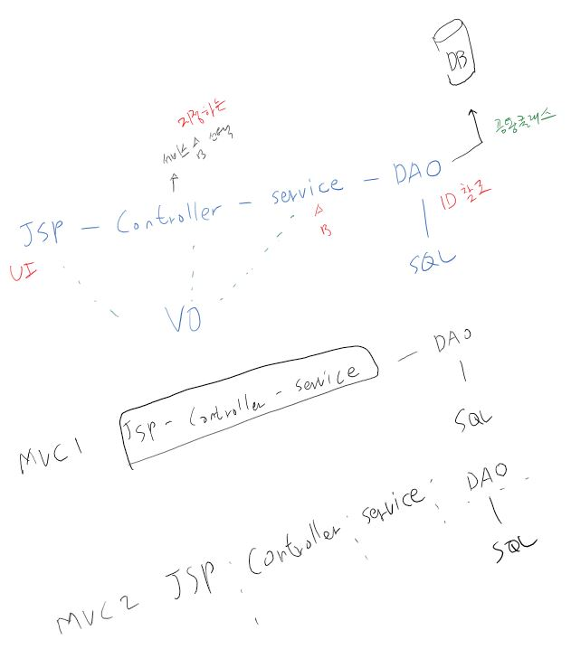

# Restart_Spring
 
- [개요](#개요)
    - [Spring 학습](#Spring-학습)
    - [Branch](#Branch)
    - [개발환경](#개발환경)
- [학습내용](#학습내용)
    - [스프링 프레임워크 핵심 기능](#스프링-프레임워크-핵심-기능)
    - [스프링 프레임워크 Core](#스프링-프레임워크-Core)
 
 ## 이력
 
 | 날짜 | 내용
 |:---:|---|
 | 2019.12.05 | 최초 생성 |
 | 2019.12.10 | 스프링 프레임워크 핵심 기능 1차 정리 |
 
 
 
    
## 개요
### Spring 학습
(출처 : 토비의 스프링 3.1)
>1. 스프링 핵심 가치와 적용 원리 이해
>    - 세 가지 핵심 기술 확인
>       - Spring IOC (Inversion of Control) 또는 스프링 컨테이너
>       - Spring AOP (Aspect Oriented Programming) 
>       - Spring PSA (Portable Service Abstraction)
>    - 프로그래밍 모델
>    - 스프링을 일관된 방식으로 이해할 수 있는 눈을 갖는 것
>    
>2. 스프링 기술에 대한 지식과 선택 기준
>    - 스프링 = 범용적인 프레임워크, 애플리케이션의 모든 레이어를 폭넓게 다루고 있음.
>    - 스프링이 제공하는 기술의 종류와 접근 방법에 대한 이해
>       - Servlet
>       - WebFlux
>    - 선택의 기준을 마련해서 상황에 맞는 최선의 기술과 접근 방법을 선택할 수 있어야 한다.
>    
>3. 스프링의 적용과 확장
>    - 스프링은 특정 아키텍처에 제한되는 프레임워크가 아님. 기술적인 문제로 쉽게 적용하지 못했던 아키텍처도 마음껏 활용할 수 있게 도와준다.
>    - 스프링에서 제공하는 기능을 그대로 사용하는 것 외에도 확장하여 사용하거나 추상화해서 사용하는 방법을 확인해야 한다.
>    - 스프링을 더 효과적으로 사용할 수 있도록 주어진 환경과 현재 프로젝트에 맞는 방식의 사용기준을 마련하고 이를 프레임워크의 형태로 만들어서 개발자들이 이용할 수 있게 해주는 것.
>    - 때로는 스프링이 직접 지원 하지 않는 기술을 접목해서 사용하는 경우를 위해 스프링에 맞게 통합하는 작업도 포함.

### Branch 
- spring-sample :  
스프링 공식 사이트 내 예제 프로젝트로 
Spring Boot 내에 Spring MVC, Spring Data를 활용하여 구현된 예제 프로젝트.  
아래 참조 링크의 내용들을 토대로 Spring에 대한 기본을 학습하고자 함.  
    - 참조 : 
        - [Spring Petclinic](https://projects.spring.io/spring-petclinic) 
        - [예제로 배우는 스프링 입문 (개정판) / 백기선](https://www.inflearn.com/course/spring_revised_edition)
        - [스프링 프레임워크 핵심 기술 / 백기선](https://www.inflearn.com/course/spring-framework_core)
        - [더 자바, 코드를 조작하는 다양한 방법 / 백기선](https://www.inflearn.com/course/the-java-code-manipulation)
        - 스프링 5 레시피(4판) / 마틴 데니엄, 다니엘 루비오, 조시 롱 (옮긴이 : 이일옹, 펴낸이 : 김태현) - 한빛미디어

- spring_config_regacy : JAVA 국비지원 교육에서 처음 접한 구조로 
전자정부 프레임워크 3.5 버전에서도 유사한 구조로 구성.  

### 개발환경
- IDE : IntelliJ IDEA Ultimate 버전
- 빌드 스크립트 : Maven, Gradle 사용 (주로 Gradle 사용 예정)
- 형상 관리 : Git

## 학습내용
### 스프링 프레임워크 핵심 기능 [내용정리](./spring-petclinic/about-spring.md)
1. Spring IoC
1. Spring AOP
1. Spring PSA

### 스프링 프레임워크 Core
1. IoC 컨테이너와 빈
1. 리소스
1. Validation
1. 데이터 바인딩
1. SpEL
1. 스프링 AOP
1. Null-Safety
