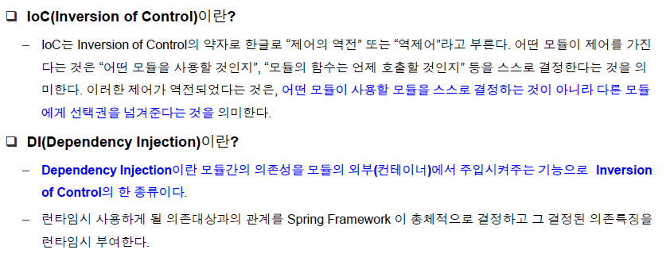
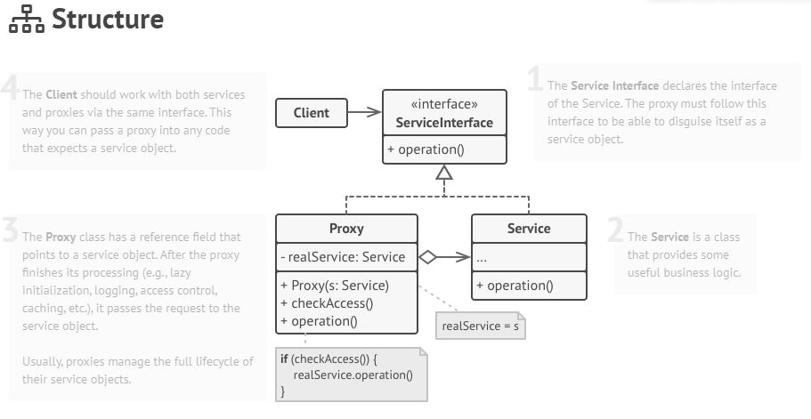

# 스프링 프레임워크 핵심 기능
## 목차
- [예제 프로젝트 확인](#예제-프로젝트)
- [Spring IoC](#Spring-IoC)
- [Spring AOP](#Spring-AOP)
- [Spring PSA](#Spring-PSA)

## 예제 프로젝트  
__Spring Petclinic__
- Maven 빌드
    - pom.xml
        - 스프링부트 (spring-boot-starter-*)
        
        - 스프링 데이터 JPA
        ```
        <dependency>
            <groupId>org.springframework.boot</groupId>
            <artifactId>spring-boot-starter-data-jpa</artifactId>
        </dependency>
        ```
       
        - DB : HSQL (In-memory DB)
        ```
        <dependency>
            <groupId>org.hsqldb</groupId>
            <artifactId>hsqldb</artifactId>
            <scope>runtime</scope>
        </dependency>
        ```
       
        - View : Thymeleaf
        ```
        <dependency>
            <groupId>org.springframework.boot</groupId>
            <artifactId>spring-boot-starter-thymeleaf</artifactId>
        </dependency>
        ```
        *** <u>devtool</u> 이 import 되면 view 수정시 앱을 다시 실행하지 않아도 새로고침으로 반영됨
        ```
        <dependency>
            <groupId>org.springframework.boot</groupId>
            <artifactId>spring-boot-devtools</artifactId>
            <optional>true</optional>
        </dependency>
        ``` 
       
        - Cache : EHCache
        ```
        <dependency>
            <groupId>javax.cache</groupId>
            <artifactId>cache-api</artifactId>
        </dependency>
        <dependency>
            <groupId>org.ehcache</groupId>
            <artifactId>ehcache</artifactId>
        </dependency>
        ```
       
        - Test : Junit (Mock : mockito)
        ```
        <dependency>
            <groupId>org.junit.jupiter</groupId>
            <artifactId>junit-jupiter-engine</artifactId>
            <scope>test</scope>
        </dependency>
        <dependency>
            <groupId>org.mockito</groupId>
            <artifactId>mockito-junit-jupiter</artifactId>
            <scope>test</scope>
        </dependency>
        ```

- 구조
    - src/main/java
    
    - src/main/resources
    
    - src/test/java
    
    - src/test/resources

- 실행방법
```
    ./mvnw package 이후 
    java -jar target/*jar
    또는 
    IDE에서 메인 애플리케이션 실행
```
    
## Spring IoC
- POJO (Plain Old Java Object) ?
    - https://itewbm.tistory.com/entry/POJOPlain-Old-Java-Object
    
- IoC ?
    - http://martinfowler.com/bliki/InversionOfControl.html  
    [(한글 의역)](https://www.egovframe.go.kr/wiki/doku.php?id=egovframework:rte:fdl:ioc_container:inversion_of_control)
    
    출처 : 전자정부프레임워크 메뉴얼    
    > 
    - 일반적인 제어권 : “내가 사용할 의존성은 내가 만든다.”
    ```
        class OwnerController {
           private OwnerRepository repository = new OwnerRepository();
        }
    ```
    
    - IoC : 사용할 의존성을 외부에서 받아옴
    ```
        class OwnerController {
            private final OwnerRepository owners;
        
            public OwnerController(OwnerRepository clinicService) {
                this.owners = clinicService;
            }
        }
    ```

- IoC Container
    - 빈(Bean)을 만들고 엮어주며 제공 (IoC 컨테이너에서 탐색하여 구성)
        - @Configuration, @Bean을 붙인 자바 구성 클래스
        - @Component, @Repository, @Service, @Controller 등을 붙인 자바 컴포넌트

    - 기본적으로 IoC Container 안에서만 의존성 주입 가능

    - 제공되는 IoC 컨테이너  
    (interface, 구성 파일은 두 컨테이너 모두 동일)
        - beanFactory
        - applicationContext (bean factory의 상위 호환이므로 이 컨테이너를 사용하는 걸 권장)

    -  applicationContext 구현체 (*** org.apache.catalina.core.ApplicationContext 아님)
    ```
        ApplicationContext context = new AnnotationConfigApplicationContext(App.class);
    ```
    또는 의존성 주입하여 꺼내오기
    ```
        @Autowired
        ApplicationContext context
    ```

- 선언된 Bean 가져오기
    - getBean("빈 이름", 빈 클래스명.class)
    ```
        OwnerController controller = (OwnerController) context.getBean("OwnerController");
    ```
    또는
    ```
        // bean이 하나라면 빈의 이름 생략 가능
        OwnerController controller = context.getBean(OwnerController.class);
    ```
    또는 의존성 주입
    ```
        @Autowired  // 또는 @Inject
        OwnerController controller;
    ```
  
- 의존성 주입(Dependency Injection)
    - 의존성을 어떻게 받아올 수 있는가?
        1. 생성자
            - 클래스에 필요한 의존성을 강제할 수 있음 (필요한 의존성 없이 생성자를 구현할 수 없으므로)
            - 의존성을 담을 변수에는 private final 선언하여 변동없도록 설정
            ```
            class OwnerController {
                private final OwnerRepository owners;
            
                // 생성자가 하나인 경우 @Autowired 생략 가능
                public OwnerController(OwnerRepository clinicService) {
                    this.owners = clinicService;
                }
            }
            ```

        1. 필드
            - 일반적으로 사용
            - 의존성 순환 문제를 피하는 방법으로 활용할 수 있음
            ```
            class OwnerController {
                @Autowired
                private OwnerRepository owners;
            }
            ```
        
        1. Setter
            ```
            class OwnerController {
                private OwnerRepository ownerRepository;
            
                @Autowired
                public void setOwnerRepository(OwnerRepository ownerRepository) {
                    this.ownerRepository = ownerRepository;
                }
            }
            ```
            
## Spring AOP
> 문제를 바라보는 관점을 기준으로 프로그래밍 하는 기법

- 공통 관심 사항을 구현한 코드를 핵심 로직을 구현한 코드 안에 삽입하는 것.
- 기존 코드를 건드리지 않고 원하는 기능을 추가

```
class A {
   method a () {
           오늘은 7월 4일 미국 독립 기념일이래요.
   }
 
   method b () {
           저는 아침에 운동을 다녀와서 밥먹고 빨래를 했습니다.
   }
}

class B {
  method c() {
          점심은 이거 찍느라 못먹었는데 저녁엔 제육볶음을 먹고 싶네요.
  }
}

class AAAABBBB {
    method aaaabbb(JoinPoint point) {
         AAAA
	  point.execute()
         BBBB
    }
}

```

- AOP 구현 방법
    - 컴파일    
    A.java ----(AOP)---> A.class (AspectJ)
    
    - 바이트코드 조작   
    A.java -> A.class ---(AOP)---> 메모리 (AspectJ)
    
    - 프록시 패턴(스프링 AOP)
        - https://refactoring.guru/design-patterns/proxy
        - 예시       
        

- Aspect, Advice, PointCut
    - Aspect : 어디에서(PointCut) 무엇을 할 것인지(Advice)를 합쳐놓은 개념
        - advice   
            매치된 Joinpoint에서 해야 할 일
            1. @Advice
            1. AspectJ : @Before, @After, @AfterReturning, @AfterThrowing, @Around
        - pointcut  
            1. advice에 적용할 타입 및 객체를 찾는 표현식 (여러 Joinpoint를 매치하기 위해 지정한 표현식)
                @Pointcut
                
            *** JoinPoint : Pointcut으로 매치한 실행 지점. 
                
        - Aspect 적용의 예
        ```
        @Target(ElementType.METHOD)
        @Retention(RetentionPolicy.RUNTIME)
        public @interface LogExecutionTime {
        }
        ```
        ```
        @Component
        @Aspect
        public class LogAspect {
      
           Logger logger = LoggerFactory.getLogger(LogAspect.class);
        
           @Around("@annotation(LogExecutionTime)")
           public Object logExecutionTime(ProceedingJoinPoint joinPoint) throws Throwable {
               StopWatch stopWatch = new StopWatch();
               stopWatch.start();
        
               Object proceed = joinPoint.proceed();
        
               stopWatch.stop();
               logger.info(stopWatch.prettyPrint());
        
               return proceed;
           }
        }
        ```
    - Advice 정리
        1. @Before :  
            특정 프로그램 실행 지점 이전의 공통 관심사를 처리하는 메서드
        
            @Before를 붙이고 포인트컷 표현식을 애너테이션 값으로 지정
            ```
            // execution(모든 수정자.모든 클래스.모든 메서드(인수가 몇 개라도 상관 없음))
            @Before("execution(* *.*(..))")
            public void logBefore(JoinPoint joinPoint) {
                log.info("The method {}() begins with {} ", joinPoint.getSignature().getName(), Arrays.toString(joinPoint.getArgs()));
            }
            ```
        
        1. @After :  
            JoinPoint가 끝나면 실행되는 메서드  
            JoinPoint가 정상 실행되거나 도중에 예외가 발생하거나 상관없이 실행
            
            @After를 붙여 표시
            ```
            @After("execution(* *.*(..))")
            public void logAfter(JoinPoint joinPoint) {
                log.info("The method {}() ends", joinPoint.getSignature().getName());
            }
            ```
        
        1. @AfterReturning :  
            JoinPoint 실행의 성공 여부와 상관없이 작동  
            JoinPoint가 반환한 결과값을 가져오려면 returning 속성으로 지정한 변수명을 Advice 메서드의 인수로 지정
            ```
            @AfterReturning(
                pointcut = "execution(* *.*(..))",
                returning = "result")
            public void logAfterReturning(JoinPoint joinPoint, Object result) {
                log.info("The method {}() ends with {}", joinPoint.getSignature().getName(), result);
            }
            ```
        
        1. @AfterThrowing :  
            JoinPoint 실행 도중 예외가 날 경우에만 실행  
            발생한 예외는 throwing 속성으로 지정한 변수명을 Advice 메서드의 인수로 지정
            ```
            @AfterThrowing(
                pointcut = "execution(* *.*(..))",
                throwing = "e")
            public void logAfterThrowing(JoinPoint joinPoint, IllegalArgumentException e) {
                log.error("Illegal argument {} in {}()", Arrays.toString(joinPoint.getArgs()), joinPoint.getSignature().getName());
            }
            ```
           
        1. @Around :  
            JoinPoint를 완전히 장악 (위의 Advice 모두를 Around로 조합할 수 있음)  
            원본 JoinPoint를 언제 실행할지, 실행 할지 말지, 계속 실행할지 여부까지 제어 가능  
            JoinPoint 인수형은 ProceedingJoinPoint로 고정
            
            *** 최소한의 요건을 충족하면서도 가장 기능이 약한 Advice를 쓰는 것을 권장 (원본 Joinpoint 실행 호출을 까먹기 쉬움)
            ```
            @Around("execution(* *.*(..))")
                public Object logAround(ProceedingJoinPoint joinPoint) throws Throwable {
            
                    log.info("The method {}() begins with {}", joinPoint.getSignature().getName(), Arrays.toString(joinPoint.getArgs()));
            
                    try {
                        Object result = joinPoint.proceed();
                        log.info("The method {}() ends with ", joinPoint.getSignature().getName(), result);
                        return result;
                    } catch (IllegalArgumentException e) {
                        log.error("Illegal argument {} in {}()", Arrays.toString(joinPoint.getArgs()) , joinPoint.getSignature().getName());
                        throw e;
                    }
                }
            ```
            
## Spring PSA
Portable Service Abstraction  
출처 : 스프링의 기술(https://12bme.tistory.com/158)
>  스프링은 JavaEE를 기본 플랫폼으로 하는 자바 엔터프라이즈 개발에 주로 사용됩니다. 따라서 다양한 JavaEE 기술에 의존적일 수밖에 없습니다. 특정 환경과 기술에 종속적이지 않다는 게 그런 기술을 사용하지 않는다는 뜻은 아닙니다. 다만 POJO 코드가 그런 기술에 직접 노출되어 만들어지지 않는다는 말입니다. 이를 위해 스프링이 제공하는 대표적인 기술이 바로 일관성 있는 서비스 추상화 기술입니다.

1. Spring Web MVC 에서의 추상화 객체 사용
    - 실제 비지니스 로직은 @Controller, @RequestMapping 에서 구현
    - Servlet (DispatcherServlet), Webflux
    - Tomcat, Netty
    
1. Spring Transaction
    - Transaction 구현은 @Transactional 사용
    - JDBC(Java Database Connectivity) 를 통해 DB 제작사에 구애받지 않고 RDBMS에 엑세스할 수 있도록 표준 API 세트 제공
        - 스프링은 JDBC를 한꺼풀 감싸 추상화한 프레임워크 형태로 제공
            > https://gmlwjd9405.github.io/2018/12/19/jdbctemplate-usage.html
    - Spring ORM(Object-Relational Mapping) 솔루션 (Data Mapper)
        - PlatformTransactionManager (JpaTransacionManager | DatasourceTransactionManager | HibernateTransactionManager | ...)
            - Hibernate, JDO, iBatis, JPA(Java Persistence API)
        - 매핑 메타데이터(클래스와 테이블 간 매핑, 프로퍼티와 컬럼 간 매핑 등)에 따라 객체를 저장
        - 객체를 저장하는 SQL문은 런타임에 실행되므로 특정한 SQL문 작성할 필요 없음 (특정 DB 기능을 사용한다거나 SQL문을 최적화(튜닝) 하는 경우엔 SQL문 작성)
        - DB에 독립적인 Application 개발 가능 (다른 DB로 Migration 용이)
        
1. Spring Cache
    - Ehcache 라이브러리를 주로 사용
        - Ehcache API, cache 추상화 (@EnbaleCaching, @Cacheable, @CacheEvict, @CachePut 등) 
    - JCache (Java EE 7 부터 등장)
